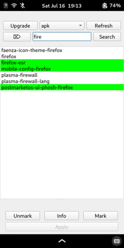

# PM Mobility Wrapper

Wrapper for package management systems (e.g., pacman or apk) with a mobile-friendly, Qt6-based graphical user interface.

## Disclaimer

This program can make changes to the installation of the operating system via interactions with package management systems. Use with care and on your own responsibility.

## Installation requirements

This tool is implemented in `Python3` and uses `Qt6`. Besides these two,  `pyside6` and, possibly, `Qt6-wayland` need to be installed. 

## Configuration

PM Mobility Wrapper executes commands of package managing systems installed on the system. These commands must be specified in a configuration file that follows the JSON syntax. Exemplary configuration files for `pacman` (on a desktop Manjaro system) and for `apk`(on the PinePhone) can be found in the  `example_conf` folder of this repository. This folder also contains a `*.desktop` file. If this file is copied to `~/.local/share/applications/`, PM Mobility Wrapper can be started from the graphical user interface (e.g., from `Phosh` on the PinePhone).

By default, PM Mobility Wrapper looks for a file called `default.conf` in the path of the `main.py` file. Therefore, one can copy or link a configuration file to this path (or modify the `main.py` file). 

The configuration for a specific package manager is stored in a JSON object, the identifier of which is used in PM Mobility Wrapper to distinguish different package managers (in principle, more than one package manager can be configured, but this is not yet tested).

Each package manager object requires the following key-value pairs (with all values being strings):

*	"install": defines the command to install packages

*	"remove": defines the command to remove packages

*	"update": defines the command to refresh package lists

*	"upgrade": defines the command to perform system upgrade

*	"version": command to get version of package manager; only used to verify that specified package managers are installed on the system

*	"info": defines the command to obtain information about packages

*	"search": defines the command to search for packages  (**note:** "search" and "list" commands are required to provide the same output format!)

*	"list": defines the command to list all available packages  (**note:** "search" and "list" commands are required to provide the same output format!)

*	"type": determines how the output of "search" and "list" are parsed. Currently, parsers for "pacman-like" and "apk-like" formats are implemented:
	*	"pacman-like" format ([installed] flag is optional): `<repo>/<name> <vers> [installed]`
	*	"apk-like" format  ([installed] flag is optional): `<name>-<vers>-r* <discarded> [installed]`

*	"terminal": specifies terminal emulator to be used and its execute flag

## Usage

The screenshot below (taken on the PinePhone) shows the user interface of PM Mobility Wrapper. The buttons in the top row allow to initiate a systems upgrade (`Upgrade`) or refreshing the repositories (`Refresh`). Furthermore, if more than one package manager is configured, the list in the middle allows for selecting the one that should be used.

The second row holds a text field to enter a (partial) package name which should be searched for by pushing the `Search` button (if the field is empty and the `Search` button is pushed, all available packages will be listed). **Note:** so far, there is no notification if no package was found. The leftmost button in the second row can be used to clear the text in the search field.

The central element of the user interface holds a list with the packages that were found. Here, green lines indicate packages that are already installed, yellow lines indicate packages marked for installation, and red lines show packages that will be removed.

Packages can be marked for installation/removal using the `Mark` button below the package list. `Unmark` discards all marked changes. 

`Info` acquires and displays information for the last selected package. The amount of information displayed here strongly depends on the package manager.

Finally, the `Apply` button allows to install/remove all marked packages. Currently, PM Mobility Wrapper opens 2 terminals here, one for the installation and a second one for the removal (unless only one of these actions is performed). This will (probably) be changed soon.

## TODO

This program is far from final. Here is a list of things that are currently work in progress:

- [ ] Notification when no packages are found
- [ ] Support for more package managers (e.g., `apt` as used on the Librem5)
- [ ] Smoothen the scrolling on the PinePhone
- [ ] Automatically activate on-screen keyboard on PinePhone
- [ ] Currently, actions such as refreshing repos, upgrading the system, and installing packages are performed by executing these commands in an external terminal. Maybe this can be integrated in the GUI.

